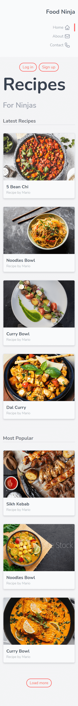

# Tailwind_css-Responsive-Landing-Page

I have made this landing page for practicing the tailwind-css framework. React is used for front-end. Hero icons, google-font is used for icons and fonts in this project. I used fakeData to populate food dish details.

:round_pushpin: [LiveSite](https://lucid-carson-9d4779.netlify.app/ "CLICK ME")

### :point_down: Screenshot of my (web) responsive landing page:
 

### :point_down: Screenshot of my (mobile) responsive landing page:
 